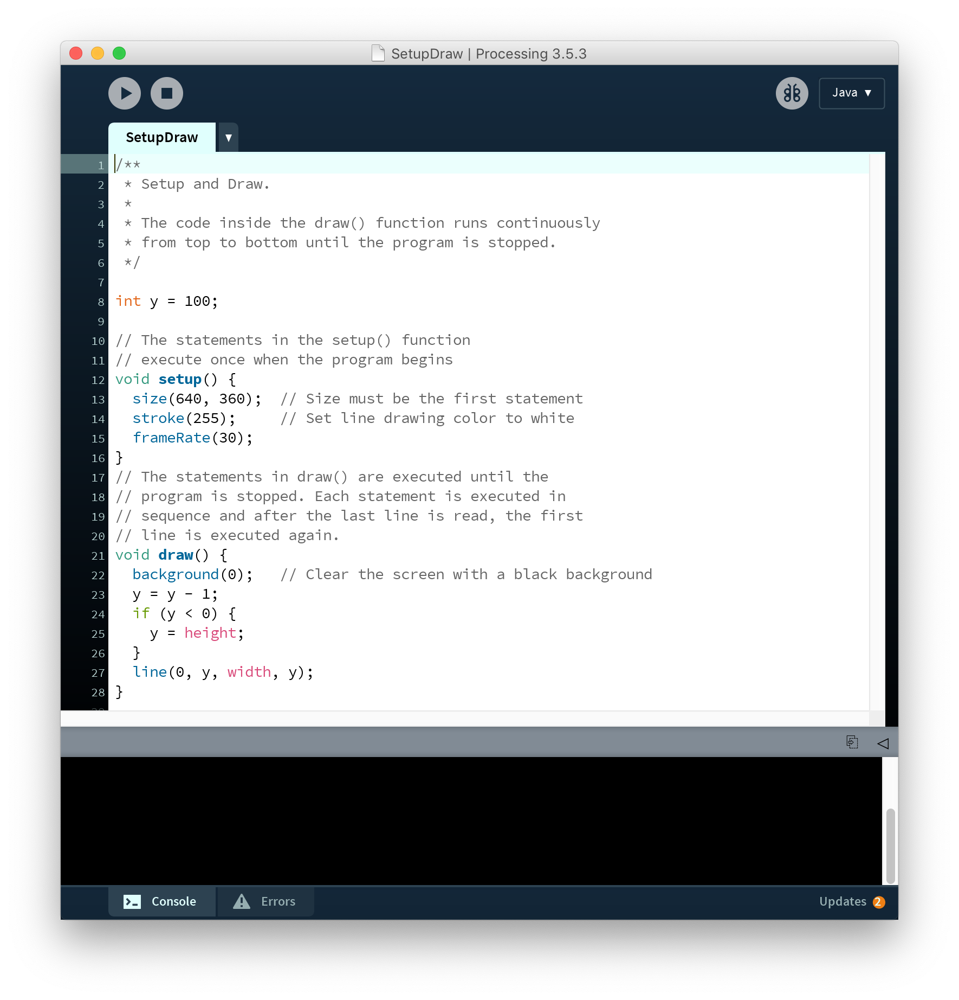
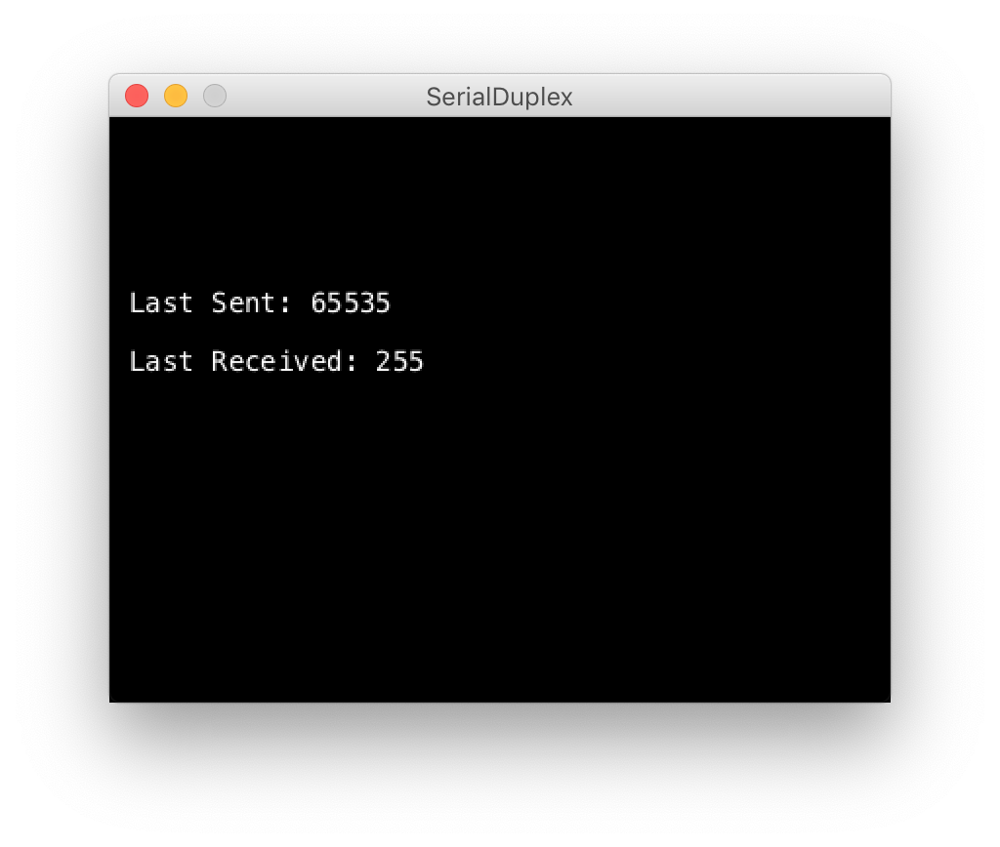

# WEEK 10

## Overview: Serial Communication Part 2

* Processing x Arduino
* Exercises
* Assignments:
	* Interfacing the Arduino with Processing
	* Journal: Develop concept for Final. Use some of the ideas from class discussion on the notion of "Smart Worlds"
* Required Parts for Week 11

## Processing


What is Processing?

>Processing is a flexible software sketchbook and a language for learning how to code within the context of the visual arts.

Processing is a ubiquitous creative coding platform for visual artists, designers, interactive artists/designers, makers, etc. It's power lies in its cross-platform (OS) functionality and the large community of creative technologists adding functionality and making cutting edge technologies available and accessible to a wider audience.

* It's an IDE like Arduino.
* You program in Java (Arduino is C++) but there are other "mode" you can code in, like javascript and python.
* It's open-source with an active community
* The precursor to P5.js, a javascript implementation of the Processing framework


### Links:

* [Processing.org](https://processing.org/)
* [reference](https://processing.org/reference/)
* [tutorials](https://processing.org/tutorials/)
* [examples](https://processing.org/examples/)


### The IDE

It's a lot like Arduino!



### Structure

* `void setup()` - same as in Arduino
* `void draw()` - functions like `loop()`

[code example](processing/basicProcessing/basicProcessing.pde)

```
/*

basicProcessing
by Phillip Stearns

A "Hello World" in Arduino is a blinking LED.
In Processing its a circle...

*/

void setup(){ // runs once before the draw() loop
  size(500,500); // must always go first, set the draw window dims
}

void draw(){ // executes onces every frameRate times/second
  background(0); // set background to black
  noStroke(); // set stroke to invisible/none
  fill(255); // set fill color to white
  circle(width/2,height/2, mouseX); // width, height, and mouseX are built in vars
}
```

### Key Differences

Aside from the fact that they are different coding languages...

* the `draw()` loop is executed at a "predictable" rate (once every `frameRate` times a second) - i.e. timing is built in
* you need to tell Processing the dimensions of the rendering window with `size()` or `fullscreen()` in the `setup()`.
* You can create classes in Processing and utilize all the cool inheritance features that come built into Java.
* Arduino relies on Libraries to deal with class-like abstractions

## Processing x Arduino

We're going to build on our work using serial communication protocols to communicate with Arduino.

Last class I demoed an example of setting up a command line interface as a way for you (and potentially users) to interact with your Arduino powered project.

This walkthrough will allow you to send messages back and forth between Arduino and Processing.

### Requirements:

1. Processing.app
2. Arduino.app
3. Arduino Board
4. Processing Libraries:
5. Arduino Libraries:

## 1. Processing <> Arduino

We're going to setup our Arduino to receive serial data from processing and send it back.

### Arduino Setup

This should look familiar. It's a slightly modified version of the code we used last week to echo message sent from the serial monitor.

* [code linked here](arduino/receiveProcessing/receiveProcessing.ino)

```
/*
    receiveProcessing echos serial characters back to the sender (Processing)
*/

void setup() {
  Serial.begin(9600); // initialize serial communication
  pinMode(LED_BUILTIN, OUTPUT);
}

void loop() { // free runnin'!!!
}

void serialEvent() {
  //Serial.read() reads in the next byte in the UART buffer
  //It must be cast as a char() to be sent back
  //note that we are using Serial.print() and not Serial.println()
  //Serial.println() will add an invisible new line character
  Serial.print( char( Serial.read() ) ); // what we receive, we send back!
}
```

### Processing Setup

Find the SerialDuplex example code in the Processing IDE:

1. Click "File"
2. Click "Examples...", a window will open.
3. Expand "Libraries"
4. Expand "Serial"
5. Double click "SerialDuplex"
6. Run it once and look at the console output. You should see something like this:

```
[2] "/dev/cu.usbmodem14201"
```

7. This is the COM port of your Arduino board. The number in the `[]` is the port number.
8. Change the line `String portName = Serial.list()[0];` to contain that number, e.g. `String portName = Serial.list()[2];`

### Contact!

1. Upload the Arduino sketch.
2. Click the 'Run' button in Processing

* When you press the keys in the active Processing window, you should see numbers representing the character for the key you're pressing.
* "Last Sent" and "Last Received" should be the same number... though there are some exceptions...



## Again, but with Strings!

### Arduino Code:

* [linked here](arduino/stringProcessing/stringProcessing.ino)

```
/*
    stringProcessing accepts serial strings from (Processing)
*/

void setup() {
  Serial.begin(9600); // initialize serial communication
  pinMode(LED_BUILTIN, OUTPUT);
}

void loop() {
  checkUART(); // serialEvent stopped becoming useful
}

void checkUART() {
  while (Serial.available() > 0 ) { // if there's stuff in the UART buffer
    String message = Serial.readStringUntil('\n'); // read strings until new line
    message.replace("\n", ""); // strip new line off the message
    if (message.equals("Ping")) {
      Serial.println("Pong");
    } else if (message.equals("Analog 0")) {
      Serial.println(analogRead(A0));
    } else {
      Serial.print("Unrecognized Command: \"");
      Serial.print(message);
      Serial.println("\"");
    }
  }
}
```

### Processing Code

* [linked here](processing/stringDuplex/stringDuplex.pde)

```
/**
 * stringDuplex sends and receives strings over serial
 * A version of 
 * Serial Duplex 
 * by Tom Igoe
 *
 * Modified by Phillip David Stearns
 *
 */

import processing.serial.*;

Serial myPort;      // The serial port
String response = "";    // Incoming serial data
String message = "";
String lastMessage = "";

void setup() {
  size(500, 250);
  // create a font with the third font available to the system:
  PFont myFont = createFont(PFont.list()[2], 14);
  textFont(myFont);

  // List all the available serial ports:
  printArray(Serial.list());

  // My Arduino typically shows up at Serial.list()[2].
  String portName = Serial.list()[2];
  myPort = new Serial(this, portName, 9600);
}

void draw() {
  background(0); // set background to black
  // display the text in the window instead of in the console
  text("Last Received: " + response, 10, 130); 
  text("Last Sent: " + lastMessage, 10, 100);
  text("Next Message: " + message, 10, 160);

  while (myPort.available() > 0) { // while there are messages, read them in
    response = myPort.readStringUntil('\n');   
    //if (response != null) print(response);
  }
}

void keyPressed() { // let's make it interactive!!!
  // println(byte(key));
  if ( key == RETURN || key == ENTER ) {
    myPort.write(message+char(10));  // send the message
    lastMessage=message; // save as lastMessage
    message = ""; // clear it
  } else if (key == BACKSPACE || key == DELETE) { // delete last character
    if (message.length() > 0)
      message = message.substring( 0, message.length()-1 );
  } else if ( key!= CODED ) { // ignore special keys like SHIFT, CONTROL, UP, etc...
    if (message.length() < 128) message+=key;
  } else if ( keyCode == UP ) { // recall lastMessage
    message=lastMessage;
  }
}

```

## In-Class Exercises

### 1. Arduino > Processing

* Send analog data from the Arduino into processing
* Have processing dynamically draw a shape that visualizes the analog data.

### 2. Processing > Arduino

* Send data to the Arduino from Processing
* Have the Arduino change an analog output based on the data it receives

## Assignments:

### Assignment 8:Interfacing the Arduino with Processing

* Build a working demo of a data visualization with bi-directional serial communication between the Arduino and Processing

### Journal Week 10:

* Develop concept for Final Use some of the ideas from class discussion on the notion of "Smart Worlds"

### Required Parts for Week 11

* ESP8266 NodeMCU CP2102 ESP-12E
	* available on amazon and [here](https://tinkersphere.com/electronic-components/1388-nodemcu-esp8266-iot-board.html)

#### Additional Resources
* [NodeMcu -- An open-source firmware based on ESP8266 wifi-soc.](https://www.nodemcu.com/index_en.html)
* [NodeMCU ESP8266](https://esphome.io/devices/nodemcu_esp8266.html)