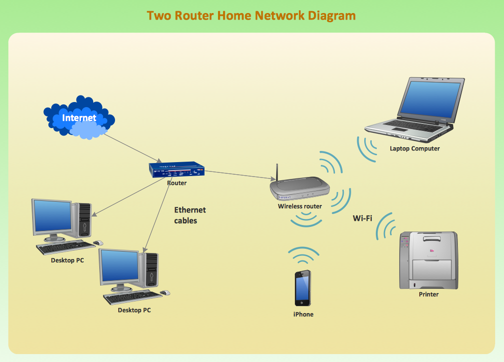
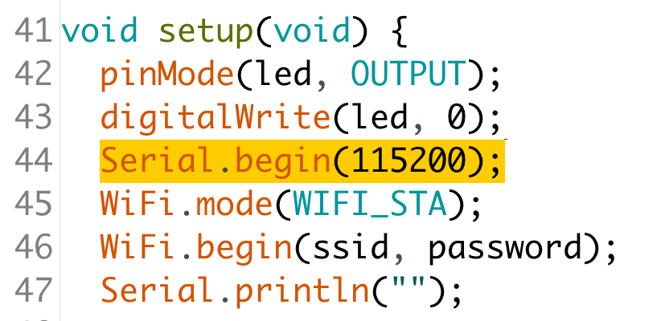
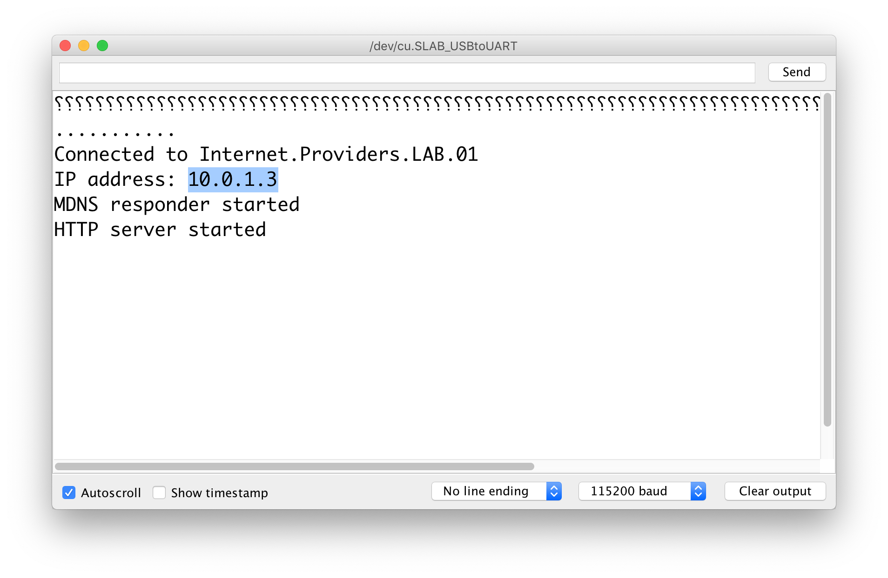
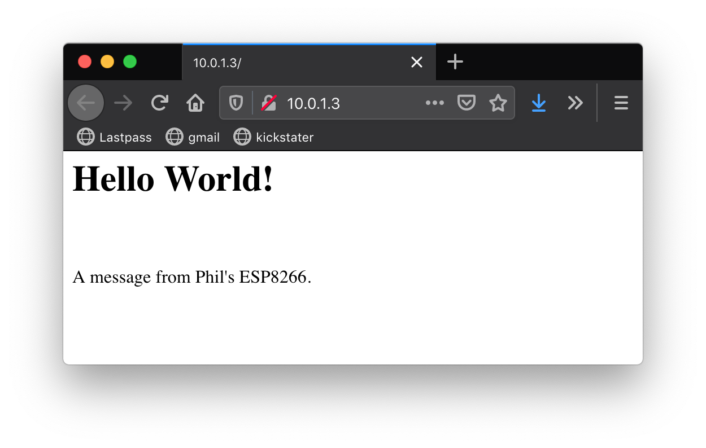

# WEEK 11

## Overview

* Quick Demos of Assignment 8
* WIFI
* QA - Open
* Assignments

---

# IoT & WIFI

## Internet of Things (IoT)


In its simplest expression, IoT is the connection of anything with an on/off switch to the Internet.

Any device that has the ability to connect to a wireless network, and to the internet, is part of the Internet of Things.

The idea is that by linking devices via the internet data and control can be accessed from anywhere in the world.
 
### How Does the Internet Work?



* Protocols
	* TCP/IP (and more!)
		* Transmission Control Protocol (TCP)
		* Internet Protocol (IP)
* Physical Hardware
	* Signals + Transmission
		* Radios
		* Wires
		* Satellites
		* Fiber Optics
	* Routing
		* Routers
		* Switches
		* Hubs
	* Devices
		* Servers
			* Computers/Devices running services
		* Clients
			* Computers/Device connecting to services

## WiFi


> Wi-Fi (/ˈwaɪfaɪ/)[1] is a family of wireless networking technologies, based on the IEEE 802.11 family of standards, which are commonly used for local area networking of devices and Internet access

[source](https://en.wikipedia.org/wiki/Wi-Fi)

> IEEE 802.11 is part of the IEEE 802 set of LAN protocols, and specifies the set of media access control (MAC) and physical layer (PHY) protocols for implementing wireless local area network (WLAN) Wi-Fi computer communication in various frequencies, including but not limited to 2.4 GHz, 5 GHz, and 60 GHz frequency bands.  

[source](https://en.wikipedia.org/wiki/IEEE_802.11)

## Security


A major topic of IoT is its security.

### Why?

Poorly secured devices can become compromised, infected with malware.


* Your network traffic could be monitored
* Other devices can become compromised
* Your credentials can be stolen
* Your devices can be used:
	* as proxies for criminal activity
	* to launch cyber attacks (DDoS)
	* for mining cryptocurrency for the attackers at the cost of performance and energy
	* to send spam mail


### Here are some good practices:

* Use strong passwords for your network acccess
* Avoid password reuse
* Use a password manager. Like 1password or lastpass.
	* Generate a store hundreds of unique complex and strong passwords, logins, secure notes, files.
	* All data is encrypted using your master password
* Strong master pass-phrase (not just password)
	* four random words
	* multiple languages makes it even more unlikely to crack
* Always change default login and admin credentials
* Disable unnecessary or unused services on your network device


## Working with the ESP8266

This guide will cover getting stared with the two following devices:

* ESP8266 NodeMCU CP2102 **ESP-12E**
<!-- * ESP8266 **ESP-01** Module -->

### Resources

* [Getting Started with ESP8266 WiFi Transceiver](https://randomnerdtutorials.com/getting-started-with-esp8266-wifi-transceiver-review/)

## ESP8266 NodeMCU CP2102 **ESP-12E**

### Ingredients:

* [Arduino IDE](https://www.arduino.cc/en/Main/Software)
* [ESP8266 NodeMCU CP2102 **ESP-12E**](https://makeradvisor.com/tools/esp8266-esp-12e-nodemcu-wi-fi-development-board/)
* [1x Micro USB cable](https://www.amazon.com/AmazonBasics-Male-Micro-Cable-Black/dp/B0711PVX6Z/) 

Additional Resources: [Arduino core for ESP8266 WiFi chip](https://github.com/esp8266/arduino)

### Arduino core for ESP8266 WiFi chip

1. Install Arduino IDE 1.8.7 or later.
2. Start the Arduino IDE and open the **Preferences** window.
3. Enter `https://arduino.esp8266.com/stable/package_esp8266com_index.json` into the **Additional Board Manager URLs** field.
4. Click **"Tools"** in the menu bar, mouse over **"Boards: ..."**, then click **"Boards Manager"**
5. Enter **"esp8266"** in the filter field and install the board package.
6. You may have to restart your Arduino IDE

Documentation: [Welcome to ESP8266 Arduino Core’s documentation!](https://arduino-esp8266.readthedocs.io/en/2.5.2/)

### Connecting to the ESP8266 NodeMCU ESP-12E

Depending on where you got your NodeMCU board, it might have one of a few different chipsets, which may or may not be automatically recognized as a USB device by your computer.

This just means we need to go through some extra steps.

#### Check to see if it's recognized

1. With the Arduino IDE open, connect the NodeMCU board to your computer.
2. Click **"Tools"** in the menu bar, mouse over **"Boards: ..."**, then click **"NodeMCU 1.0 (ESP-12E Module)"**
3. Click **"Tools"** in the menu bar, mouse over **"Port"**
4. If you don't see anything that looks like `/dev/cu.SLAB_USBtoUART`, `/dev/tty.SLAB_USBtoUART`, `/dev/cu.wchusbserial14210`, or `/dev/tty.wchusbserial14210`, then you likely need to install the drivers for the board.

This should install a bunch of examples and libraries along with the info to compile Arduino sketches for the ESP8266 modules and boards.

#### Installing the SiliconLabs C2102 Driver [MOST LIKELY]

* [CP210x USB to UART Bridge VCP Drivers](https://www.silabs.com/products/development-tools/software/usb-to-uart-bridge-vcp-drivers)

#### Installing the CH340 Driver

* [CH340 Drivers for Windows, Mac and Linux](https://sparks.gogo.co.nz/ch340.html)

#### After installing the drivers

6. You may have to restart your Arduino IDE.
7. Check to see whether your board is recognized.

### Hello World

Once you have your board connected to and recognized by your computer, it's time to test everything out.

#### Blink

1. Click **File** > mouse over **Examples** > mouse over **01.Basics** > click **Blink**
2. Upload the sketch and confirm that your board blinks.

#### WebServer

1. Click **File** > mouse over **Examples** > mouse over **ESP8266WebServer** > click **HelloServer**
2. In **line 7**, change the text `your-ssid` to `Internet.Providers.LAB.01`
3. In **line 8**, change the text `your-password` to `!ns3cur3`
4. (optional) Edit the hello world message on line 20. Basically an HTML one-liner at this point. See before/after example below:

Before:

```
server.send(200, "text/plain", "hello from esp8266!");
```
After:

```
server.send(200, "text/HTML", "<html><h1>Hello World!</h1><br><p>A message from Phil's ESP8266.</p></html>");
```

5. Make note of the Serial baud settings. Default is `115200`



6. Open the serial monitor and set the baud to match the sketch.
7. Upload to your board!
8. Check your monitor for communication from your board.



9. In a browser of your choice, navigate to the IP address



### SUCCESS!


<!-- ## ESP8266 **ESP-01** Module -->

## Assignments

1. Modify the HelloServer to display the value of an analog sensor using an inline url request, for example `http://10.0.1.3/sensor1`
2. Modify the sketch to parse inline requests so that a request like this: `http://10.0.1.3/?display=sensor1&LED1=on` displays the value of a sensor and turns on an LED. [hint](https://links2004.github.io/Arduino/d3/d58/class_e_s_p8266_web_server.html)

Explore these new found powers!


### Research Group 4

Select a topic from those remaining [here](../../resources/research.md):

* Risks
* Complexity

### Final Project

Create a project proposal and submit a **PDF** version that has the following components:

* **Narrative Description**
	* minimum 1-paragraph description of what is physically present and how the viewer experiences the project.
	* minimum three references: inspiration / aesthetic ( other projects )
* **Technical Description**
	* minimum 1-paragraph description listing components and parts, how they interact, technologies involved, spatial and material requirements.
	* minimum three references: technical papers ( technologies, datasheets, tutorials )
* **Conceptual Description**
	* minimum 1-paragraph description of the context and reason for the project ( exploration is fine, but remember that you're not the first to go down this path. Find examples. )
	* minimum three references: conceptual research ( historical, science, sociology, technical )

* **Block Diagram of Elements and Interactions**
* **Conceptual Renderings of the Project**
	* Big Picture
	* Detail of Objects and Interactions

Your project idea is expected to be conceptually and technically strong. Just like your Phys-Comp skillz at this point.

*Be prepared to present and begin work next class!*