# WEEK 3

## Overview

* Pop Quiz
* Arduino
	* How to help yourself
	* Coding Principles
	* Timing
	* Input / Output
* Lab
* Think Tank: Towards a new Definition of Smart

## Pop Quiz

* identify components and schematic symbols
	* battery
	* switch
	* resistor
	* led
* draw schematic
	* simple (series) circuit
	* simple parallel LED circuit
* ohm's law
	* write out the properties related
	* write out the relationships
	* write out the three formulations of the law
* AC vs DC
* Current
* Voltage
* Resistance

## Arduino Intro

Arduino is a system that allows for the development of software for microcontrollers, the brains of physical computing projects. When we want a microcontroller to perform a particular task, we have to write software that reads inputs, performs some calculations, and changes output. The code has to be uploaded onto the device.

Arduino is an integrated development environment that allows for all of this to happen using one application.

### Startup

When you launch Arduino, you'll be presented with the default "bare minimum" sketch.

Arduino is an integrated development environment (IDE):

* color coded text editor
* compiler
* uploader
* debugger
* examples
* library management
* hardware presets

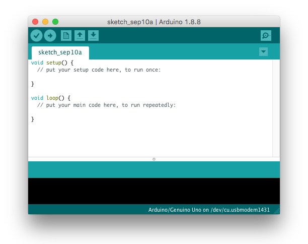

Arduino projects are called sketches. When you save them, the are placed in their own folder of the same name. This actually helps keep your file system tidy and easy to navigate. Embrace it.

### Board Settings

The Arduino IDE automatically compiles code based on the board and processor combination. We need to tell the IDE which board and processor we're using.

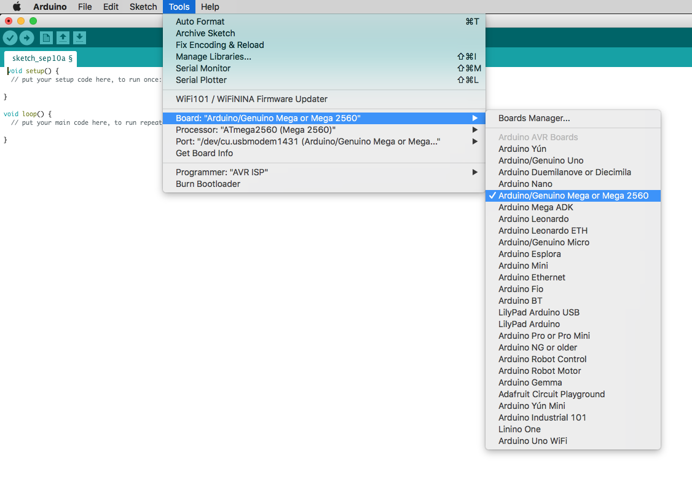

Arduino also needs to know where your'e connecting the board. The port specification tells the IDE where to look for the board. USB, Bluetooth, WiFi or some other port. We'll generally be using USB.

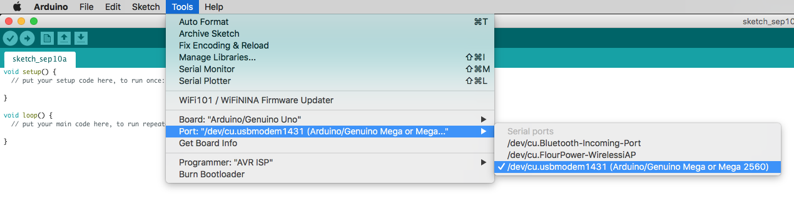

### Hello World!

A "Hello World" program is a simple program that tests basic output. In the case of physical computing systems, that includes a hardware output: a blinking LED. The "Blink.ino" example is just this.

You can find it in the examples section:

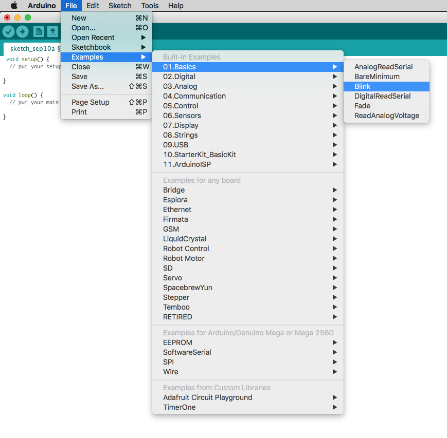

Have a look at the code. Can you tell what it does?

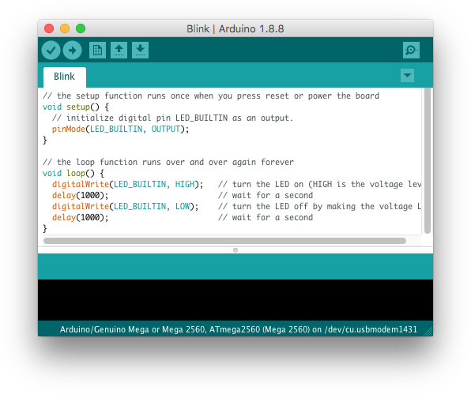

### Uploading

When we are ready to upload our code, first we run a quick verification to quick catch any errors. We're going to make mistakes. That's just a part of coding.

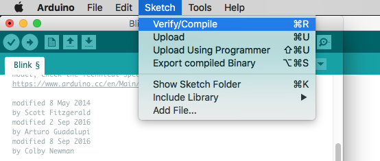

The console output will display the process and any errors, if present...

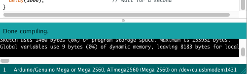

Hmm...

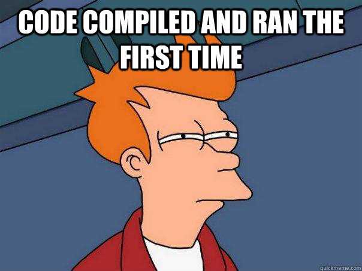

J/K it's fine! Let's upload it.

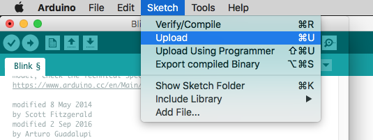

\*crosses fingers\*

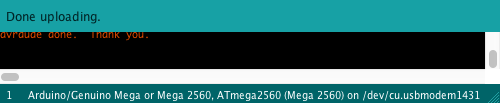

**SUCCESS!**

### Common Errors When Uploading

Board got disconnected:

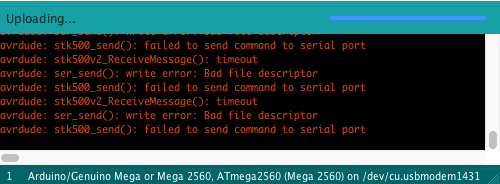

Wrong board or processor selected:

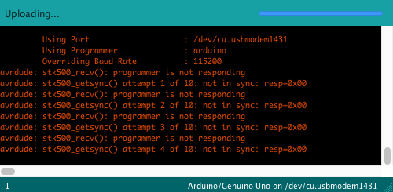

## Coding Basics

* Arduino Structure
	* void setup()
	* void loop()
* Data Types
	* boolean
	* integer
	* float
	* string
* Constants
* Variables
* Functions
	* calls vs definitions
* Arrays

* Inputs
	* pinMode()
	* digitalRead()
	* analogRead()
* Outputs
	* digitalWrite()
	* analogWrite()
* Conditionals
	* if / elseif / else

## Lab Exercises

* Load 'Blink' example to your board
* Modify the 'Blink' example in the following ways
	1. Make it blink slower
	2. Make it blink faster
	3. Add a routine that makes it blink when you close a switch
	4. Modify the routine so that it blinks one speed when one switch is closed and a different speed with another switch is closed

## Timing Tricks

* delay()
* millis()
