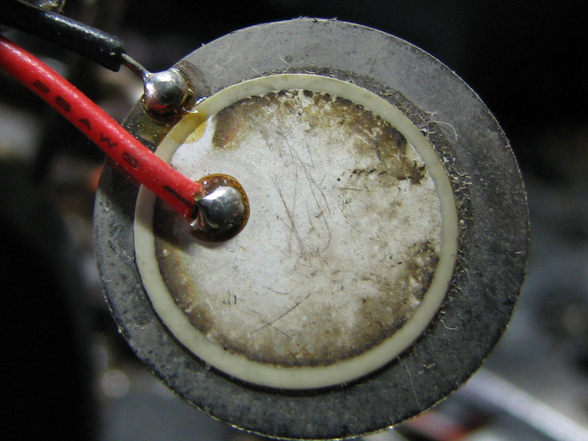
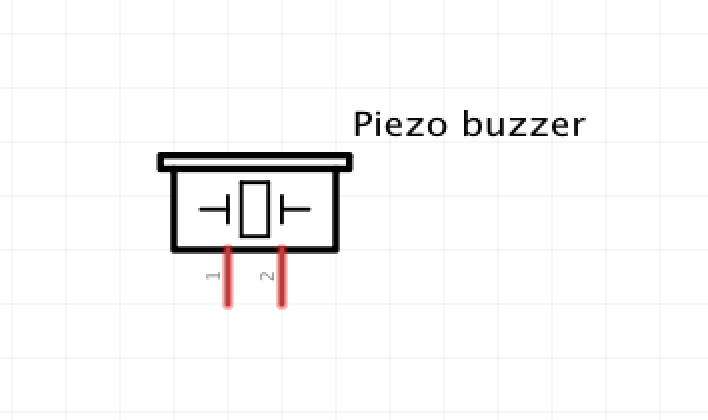
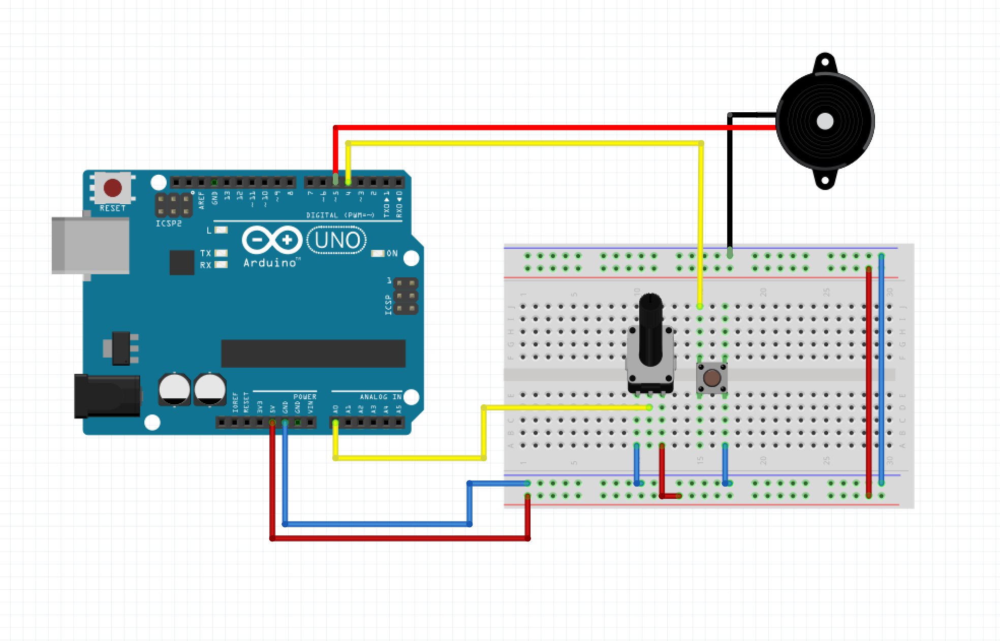
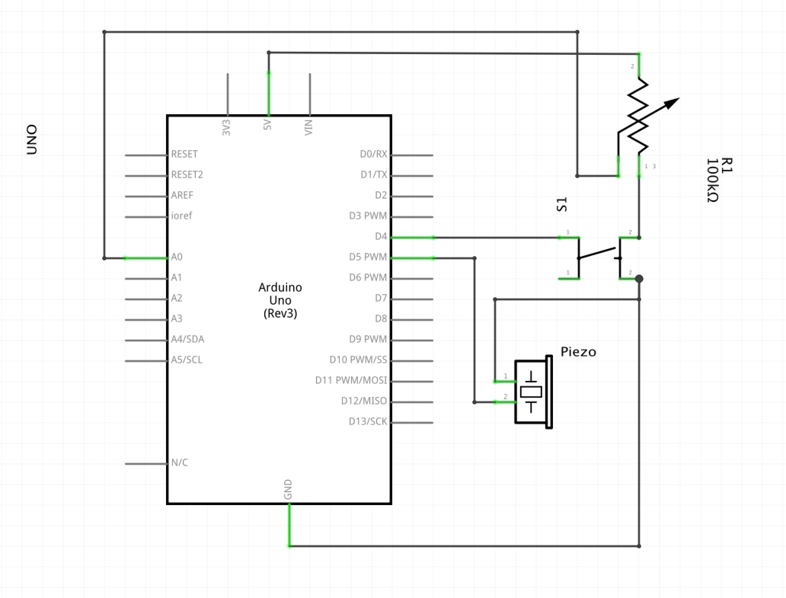
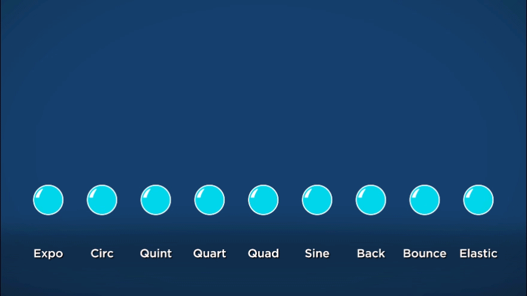
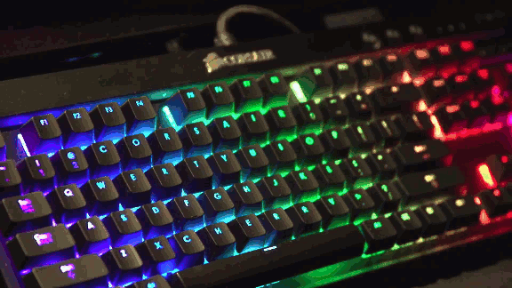
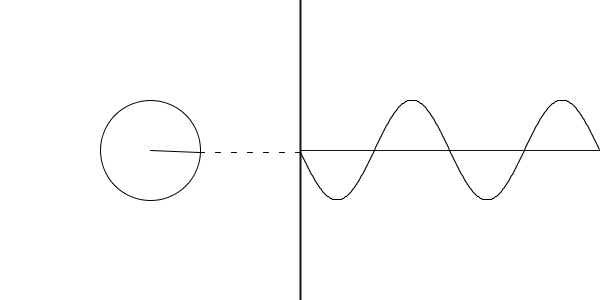

# WEEK 5

## Overview

* Research Presentation from Group 1: Design Elements, Principles, and Methodologies
* Class Discussion
* Analog Outputs
* Smooth Functions

## Discussion


* Think of questions you have for the presenters
	* ask at least one
* How does this relate to physical computing?
* How are we already living with these ideas?
	* Examples
		* in media
		* in the objects we use
		* in pop culture
* How could these idea be put into practice?
	* in daily life
	* in our designs and creative practices
* What ideas are we already putting into practice?
* Do you have any critiques of the ideas? 

## Analog Outputs I: PWM


(most) Arduino boards do not have built in Digital to Analog converters. But they do have the ability to precisely control the timing of on and off signals.

### Pulses and Rectangle/Square Waves

A pulse is a momentary change in the output of a digital pin from LOW to HIGH.

When pulses arrive at a constant rate or frequency, the produce a pulse wave or rectangle wave. A square wave is a special case of rectangle wave where the duty cycle is 50% on 50% off.

### Duty Cycle and Frequency

If the rate of our pulse stream is fast enough, we can control the duty cycle to achieve effects like dimming an LED or controlling the speed of a DC motor.

With a fast enough frequency and some filtering, you can even [produce audio](https://create.arduino.cc/projecthub/106958/pwm-sound-synthesis-9596f0). This is also the idea behind [Class-D amplifiers](https://en.wikipedia.org/wiki/Class-D_amplifier)

## [analogWrite()](https://www.arduino.cc/reference/en/language/functions/analog-io/analogwrite/)

`analogWrite()` uses the PWM output capabilities of the Arduino microprocessors. Each board has specific pins that support PWM output.

* UNO PWM Pins: `3, 5, 6, 9, 10, 11`
* PWM Frequencies: 490 Hz (pins 5 and 6: 980 Hz)

### Usage:

`analogWrite(pin, value)`

* pin - type `int`
* value - type `int`, 0 (off) - 255 (on)
	
```
int ledPin = 9;      // LED connected to digital pin 9
int analogPin = 3;   // potentiometer connected to analog pin 3
int val = 0;         // variable to store the read value

void setup() {
  pinMode(ledPin, OUTPUT);  // sets the pin as output
}

void loop() {
  val = analogRead(analogPin);  // read the input pin
  analogWrite(ledPin, val / 4); // analogRead values go from 0 to 1023, analogWrite values from 0 to 255
}
```

## In-Class Exercise

* use an analog sensor of your choice to control the brightness of an LED using `analogWrite()`.


## Analog Outputs II: Pulse Frequency Modulation

### The Problem:

`analogWrite()` is a built-in function that allows us to control the pulse width of a PWM output. What if we wanted to vary the frequency of a pulse based on a value we capture from an analog sensor?

### The Requirements:

* express a continuous varying value by changing the rate of pulses output by a digital IO pin
	* we need a timer routine that creates a pulse of a fixed duration
	* we need another timer routine to set the duration between pulses
	* the duration between pulses is influenced by a continuously varying value
* our solution must be audible (hint: use a piezo or speaker)
* only audible when a button is pressed

### Planning the code:

Pseudocode:

```

if (debounceInterval == true) readButton()
if (button == pressed) makeSound()

makeSound(){
	if (frequencyInterval == true){
		adjustFrequency( analogRead(sensorPin)) // adjust rate
		pulseStart = currentTime // trigger new pulse
}

if (currentTime - pulseStart < pulseDuration){
		digitalWrite(speakerPin, HIGH)
	} else {
		digitalWrite(speakerPin, LOW)
	}
}


```

## Piezoelectric Speakers (Piezo)



A Speaker is a transducer that transforms current into sound. Sound is phenomenon that is most commonly experienced as fluctuations in air pressure. Although we hear with our ears, sound can be conducted to the eardrums through direct bone vibrations.

Piezoelectric Speakers contain a crystal that expands when subjected to a charge. They're probably the simplest sound makers we can get.

### Schematic Symbol

According to Fritzing, the piezo is drawn using this symbol:



## In-Class Exercises

Form up into teams of 

* use a potentiometer to vary the pulse frequency sent to a buzzer.

### Wiring Diagram



### Schematic



## [map()](https://www.arduino.cc/reference/en/language/functions/math/map/)

You might notice that it's a bit annoying to have to code the math to scale between a range of delays based on a range of input in the challenge above.

Thankfully there's a built-in function that allows us to "map" a value from one range onto another.

If we want to scale from 0-1023 to 5ms to 500ms, we use the `map()` function: 

```
float scaledValue = map(inputValue, 0, 1023, 5, 500);
```

The generalized formulation of the function is:

```
map(value, fromLow, fromHigh, toLow, toHigh)
```

## Smoothing


## Easing

Now that we have a way to create range of brightnesses, and frequencies based on an analog input, let's switch gears and consider a different situation.

Say we have a single switch or analog input that crosses a threshold. When the switch is pressed or the threshold crossed, we want an LED to turn on, but not all at once, we want it to fade on and fade off.

Easing is a technique that allows us to accomplish this.



The most basic form of easing is a "geometric ease-in":

* calculate the difference between my currentValue and targetValue
* multiply the difference by some amount between 0 and 1
* add that amount to my currentValue
* repeat until the currentValue = targetValue

### Have a look at the following code:

```
#define LED_PIN 5

float currentValue;
float targetValue;
float easingAmount;

void setup(){
  currentValue = 0;
  targetValue = 255;
  easingAmount = .125;
  Serial.begin(9600);
}

void loop(){
  currentValue += easingAmount * ( targetValue - currentValue );
  Serial.print("currentValue: ");
  Serial.print(currentValue);
  Serial.print("\t targetValue: ");
  Serial.println(targetValue);
  analogWrite(LED_PIN, (int) currentValue);
  delay(250);
}
```

* let's walk through and see if we can't predict what the output will be.

### Other approaches

Easing can get pretty complex and complicated. One approach taken by animators is to use keyframes, and use various different equations to compute where a value should be given a particular position on its timeline.

From the start to the finish, we can normalize to t=0 and t=1. Then, all we need to do is find a set of equations that describe the kind of easing we want when presented with values from 0 to 1.


### Example of progress related easing

```
#define LED_PIN 5
#define BUTTON_PIN 4

unsigned int trigger_time;
float progress, ease_time;

void setup(){
	trigger_time = 0;
	ease_time = 2500.0;
	progress = 0.0;
	pinMode(LED_PIN, OUTPUT);
	pinMode(BUTTON_PIN, INPUT_PULLUP);
}

void loop() {
	current_time = millis();
	if (buttonIsPressed()) {
		trigger_time = current_time;
		progress = 0;
	}
	
	progress = (current_time - trigger_time) / ease_time;
  	
  	if (progress <= 1) {
  		analogWrite(LED_PIN, int(255 * pow(progress, 2)));
  	}
}

```

* What's missing from the code above?

## Sinusoidal Functions

This is why they're awesome!



The sinusoidal equation takes the full form `y = A * sin( B * (x - C)) + D`, where:

* `A` is the amplitude
* `B` is the frequency*
* `C` is the horizontal shift (phase)
* `D` is the vertical shift.

Some cool properties:

* The period of the wave is `2*PI / B`
* When `A = D`, the range of output is `0 - 2*A`
* For 0-1 output, the equation simplifies to `0.5 * sin( 2.0 * PI * x) + 0.5`




## Assignment 5


* Modify the first easing code example (geometric) to toggle easing on and easing off when triggered by an analog event.
* Modify the second easing code example (progress) to use `sin()` to do a single smooth pulse in response to an analog event.
* use `pow(x, 2)` and `sin()` to make an LED breathe
* use your smoothing super powers to modulate the pitch of a buzzer in different ways to digital and/or analog inputs. (bonus)

## Journal WK 5

Take some time to think about potential direction for your work in this class.

* Are there particular interactions you're interested in?
* Are there particular contexts that you want to engage with?
* What kind of research have you already been doing?
* Is there something in your personal experience that you want to bring to future physical computing projects?


## Research Presentation Group 2

### October 9th - Is It Sustainable?

The economic and ecological consequences of the present state of smart technologies and potential future outcomes of scaled smart technologies.
