# WEEK 6

## Overview

* Check-in Q & A
* Datasheets
* Diodes and Transitors
* High-power circuits
* Inductive Loads (relays, motors, transformers)

## Q&A


* Was there anything from the assignments that got you stumped?
* Are there any exciting ideas you've encountered that you might want to turn into a project?

## Datasheets

When you need to know specific characteristics of an electronic component for your design work (electrical and physica), datasheets will have everything you need to know:

* **Physical Measurements**
* Features
* Physical Properties
* Materials
* **Description of Function**
* **Typical Operating Performance**
* **Absolute Maximum Ratings**
* Component Specific Data
* **Applications**
* Technical Drawing
* Tolerances
* and more

Let's have a look at an LED datasheet. [This one](http://www.adafruit.com/datasheets/WP7113SRD-D.pdf) is sourced from [Adafruit](https://learn.adafruit.com/all-about-leds/the-led-datasheet) (I've also hosted it locally [here](resources/LED.pdf)).

### At A Glance

The First page of a datasheet typically starts off with a list of features, a description, a drawing, and a few general specifications. Our LED datasheet is pretty typical by these accounts.

### Electrical Characteristics

Before we get deep into what a diode is and how it works, have a look at this specification: forward voltage.

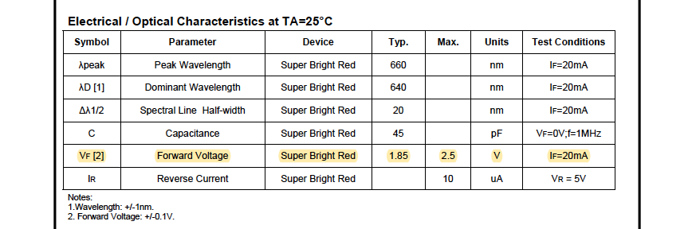

This is the amount of voltage that the diode requires before it will start conducting and emitting any light. Below this amount and there will be no current! More on this later...

### Absolute Maximum Ratings

If these values are exceeded, you can expect your part to fail. The feed forward current places an upper bound on how bright your LED can get and gives us a target amperage to calculate which resistor value we should use.

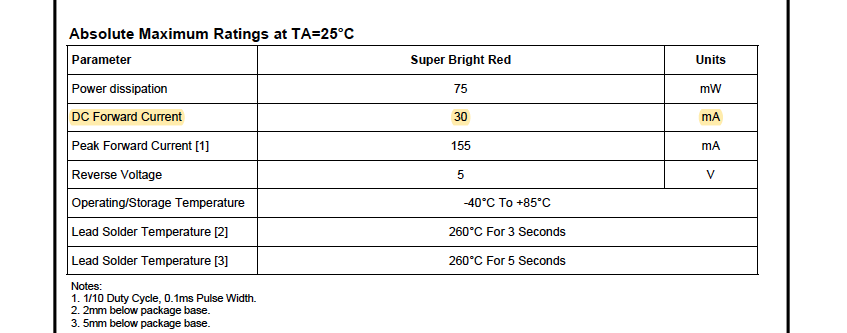

## Tiny Challenge

Given the Forward Voltage and Maximum DC Current, find the power supply and resistor value that will:

* produce the maximum current the LED can handle
* provide the minimum amount of voltage to turn on any LED

## Diodes

According to [wikipedia](https://en.wikipedia.org/wiki/Diode):

>A diode is a two-terminal electronic component that conducts current primarily in one direction (asymmetric conductance); it has low (ideally zero) resistance in one direction, and high (ideally infinite) resistance in the other.

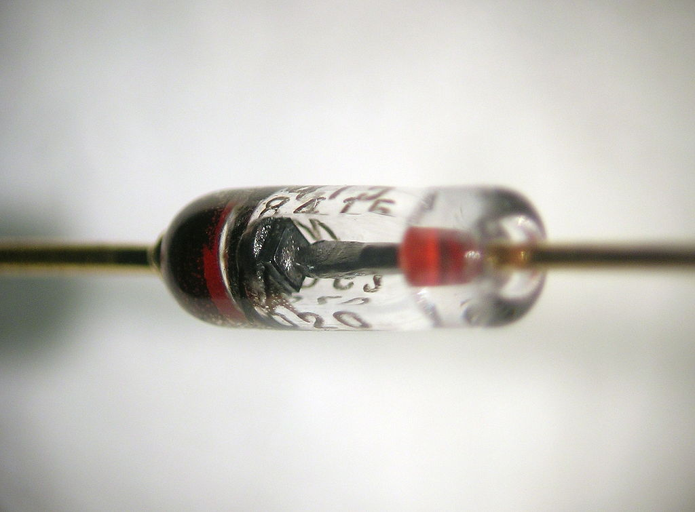

The main function of a diode is to pass current in a single direction.

* current passes in the forward direction
* current is blocked in the reverse direction

### Symbols

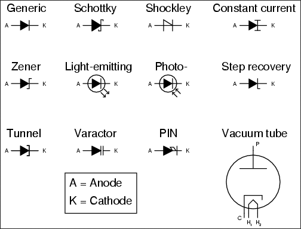

* **Anode** (+) - an electrode where conventional (positive) current enters (electrons leave)
* **Cathode** (-) - an electrode where conventional (positive) current leaves (electrons enter)

### Structure

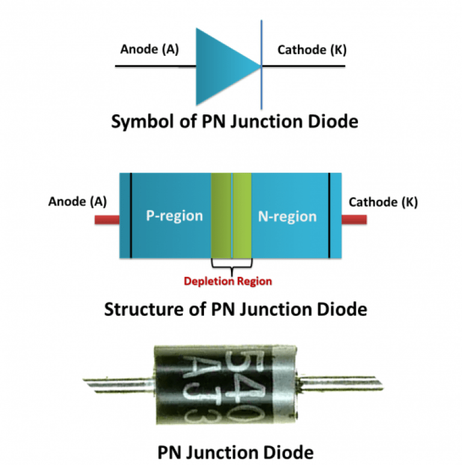

Diodes are made of semi-conductive materials. Impurities are added to semi-conductive materials to create two different types:

* **p-type semiconductor** - has positive charge carries (holes)
* **n-type semiconductor** - has negative charge carries (electrons)

When these two materials are brought into contact, charges move to equilibrium, creating a third region devoid of charge carriers (neutral), called a **depletion region**.

* In the diode, this is the **p-n junction**.
* Electrons can flow through the depletion when positive voltage is applied across the p and n terminals (forward bias).
* The current is blocked from flowing in the reverse direction when voltage is applied across the n and p terminals (reverse bias)... up to a point

## LEDs Revisited

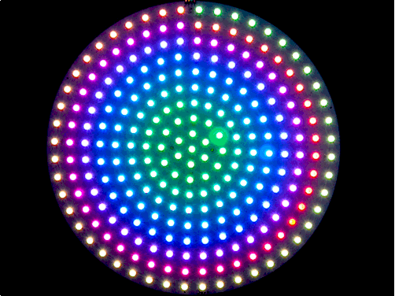

The colors of LEDs are determined by the amount of energy that an electron dissipates as it passes through the depletion region.

But RGB LEDs actually have three different diodes with different tunings inside!

## Transistors (Bipolar Junction Transistors)

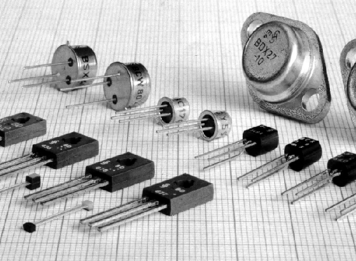

According to [wikipedia](https://en.wikipedia.org/wiki/Transistor)

> A transistor is a semiconductor device used to amplify or switch electronic signals and electrical power. It is composed of semiconductor material usually with at least three terminals for connection to an external circuit. A voltage or current applied to one pair of the transistor's terminals controls the current through another pair of terminals. Because the controlled (output) power can be higher than the controlling (input) power, a transistor can amplify a signal.

### Schematic
 


### Structure

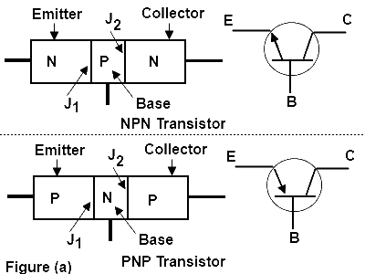

Where have we seen p-n junctions before?

### Function

The main function of a transistor is to amplify.

* In the case of BJT transistors, current is amplified.
* Small amounts of currents between the **base** and **emitter** of BJT permits larger currents to flow between the **collector** and **emitter**


### Amplification

The amplification factor is called **hFE** or beta (ß). It's a gain multiplier.

```IC= hFEIB=βIB```

[further reading](http://www.learningaboutelectronics.com/Articles/What-is-hfe-of-a-transistor)

## Group Analysis

Let's analyze the following circuit:

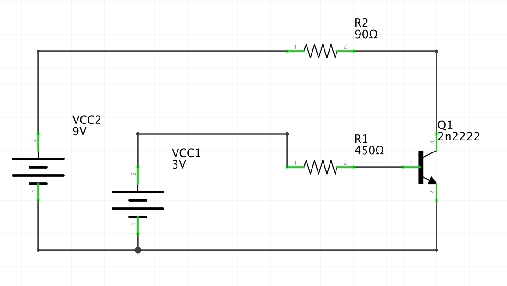

1. Find the hFE of the 2n2222 Transistor on the [Datasheet](resources/2N2222.pdf) using IC = 10 mAdc, VCE = 10 Vdc
2. Calculate the current flowing into the base and through the emitter to ground.
3. Multiply the two to find the theoretical current allowed to pass between the collector and the emitter
4. Is this within the transistor's maximum ratings?
5. If we wanted the transistor to sink as much current as the 90 ohm resistor will allow, what value should R2 be?

## Class Excercise: Motor Speed Control

### Build the following circuit:

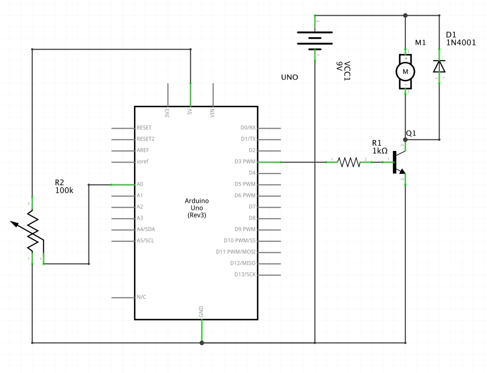

### You'll need:

* 1x Arduino Uno
* 1x 9V Battery
* 1x 9V Battery Clip
* 1x 1k Ohm resistor
* 1x 2n2222 NPN Transistor
* 1x 1n40001 Diode
* 1x Potentiometer (10k - 100k range is fine)

### Wire it up:

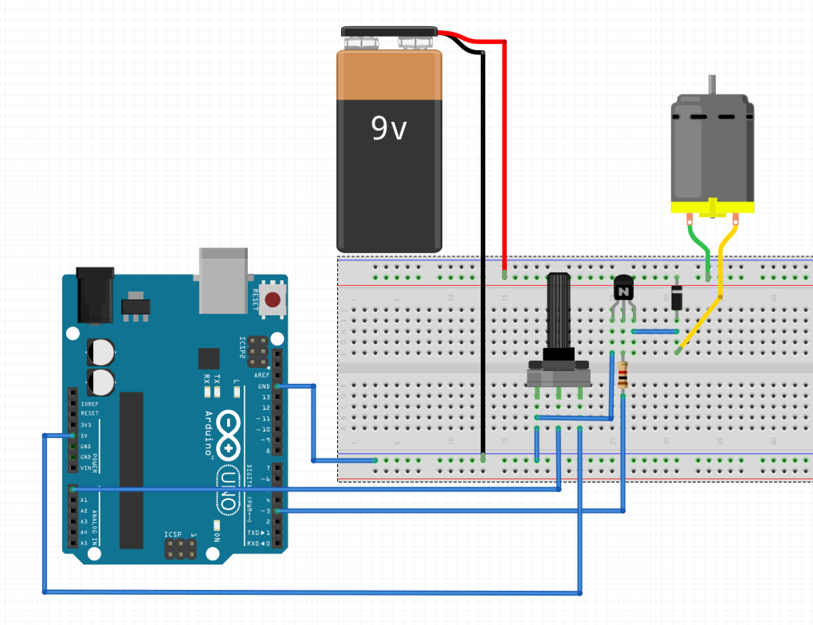

### Write the Code:

* converts analog input to PWM
* PWM used to drive the motor via the transistor

## Driving a Motor with the H-bridge

From [wikipedia](https://en.wikipedia.org/wiki/H_bridge)

>An H bridge is an electronic circuit that switches the polarity of a voltage applied to a load. These circuits are often used in robotics and other applications to allow DC motors to run forwards or backwards.

### The Schematic

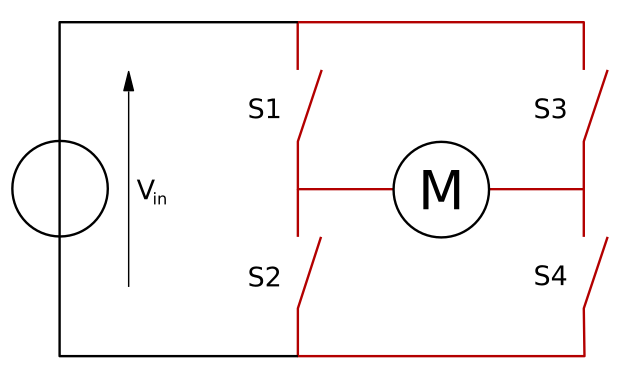

### Forwards and Reverse


### Control Possibilities

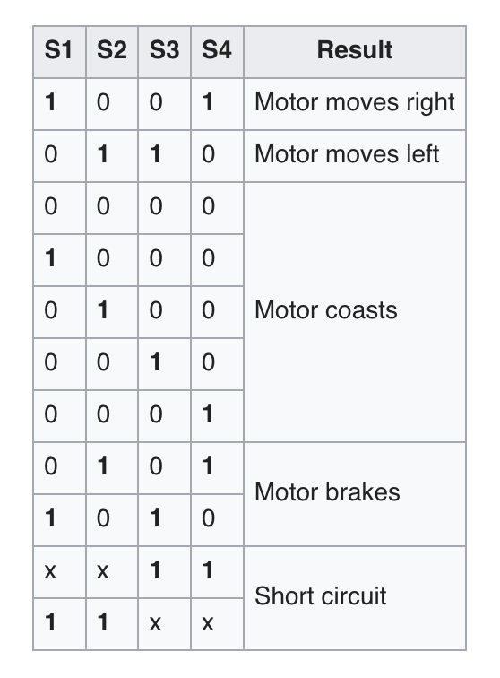

### [L293D QUAD Half-H Drivers](resources/L293D.pdf)

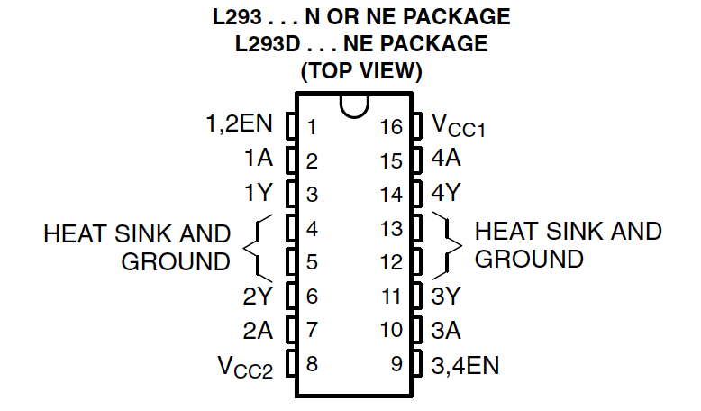

The L293D is an integrated circuit (IC) that allows us to drive a range of different motors.

* a single half-h drivers allow us to move one DC motor in one direction
* two half-h bridges allow us to make a full h-bridge and therefore control the direction of a motor as described above
* using all 4 half-h drivers can allow us to drive stepper motors

**An Application Note** from the datasheet that shows an application of how we can use the IC in place of transistors to drive DC motors:

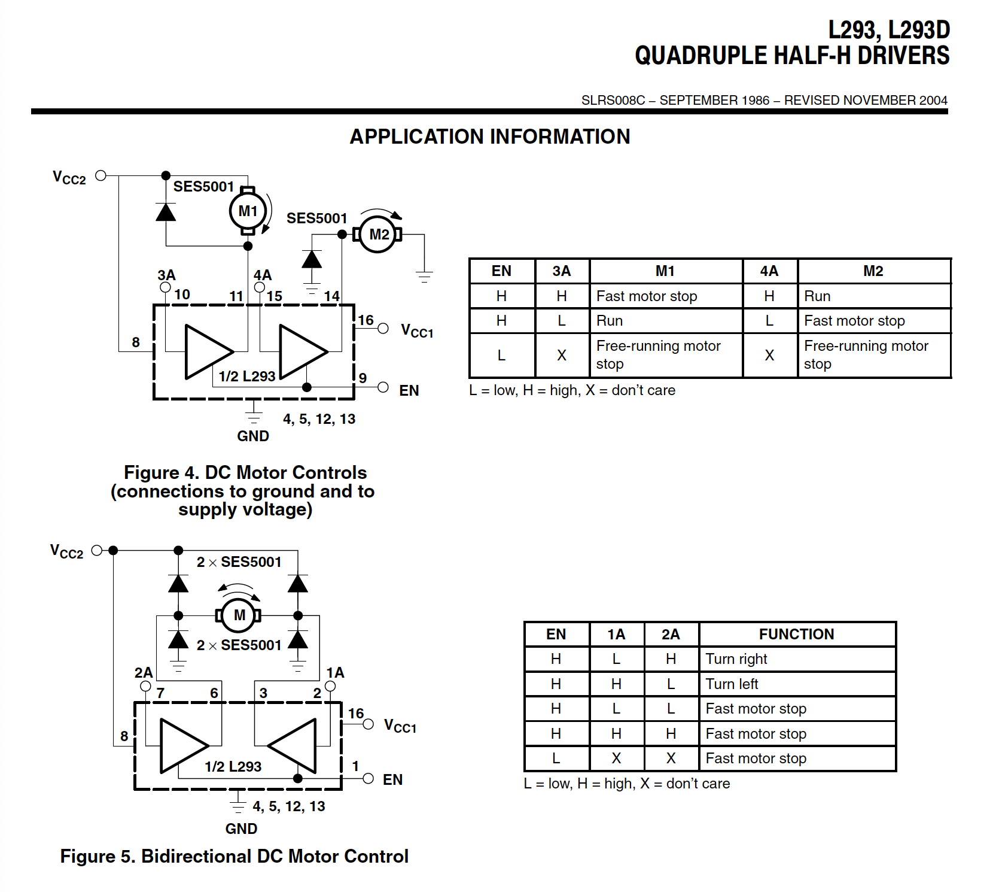

## Class Exercise: Bidirectional DC Motor

* Use the [L293D](resources/L293D.pdf) datasheet to wire up a circuit that will allow you to control the direction of a DC motor using the Arduino with a toggle switch
* Add the ability to control the speed with a potentiometer (hint: use the PWM outputs of the Arduino and EN input pins on the L293D)

## Servos

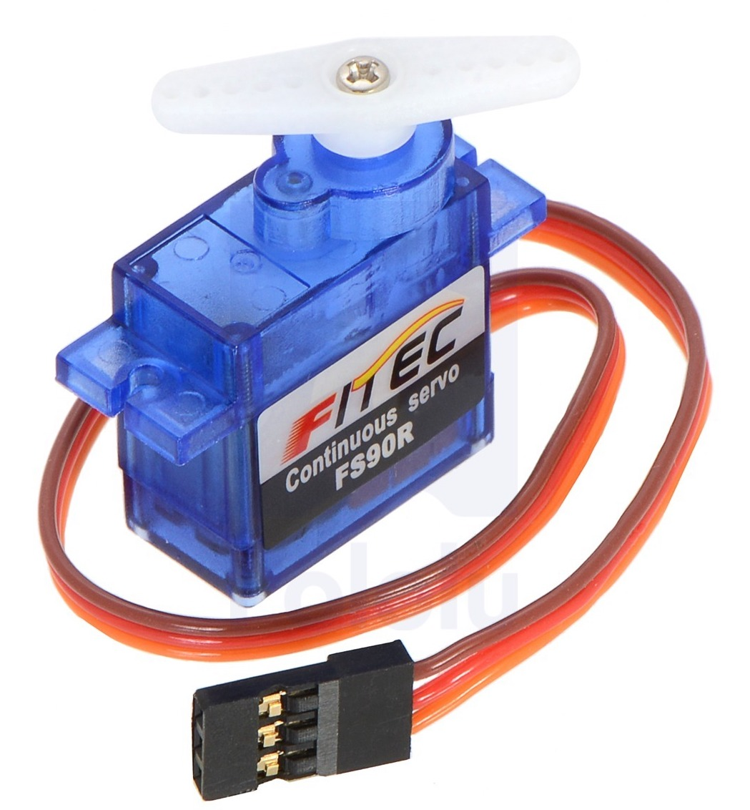

>The position of the servo motor is set by the length of a pulse. The servo expects to receive a pulse roughly every 20 milliseconds. If that pulse is high for 1 millisecond, then the servo angle will be zero, if it is 1.5 milliseconds, then it will be at its centre position and if it is 2 milliseconds it will be at 180 degrees.

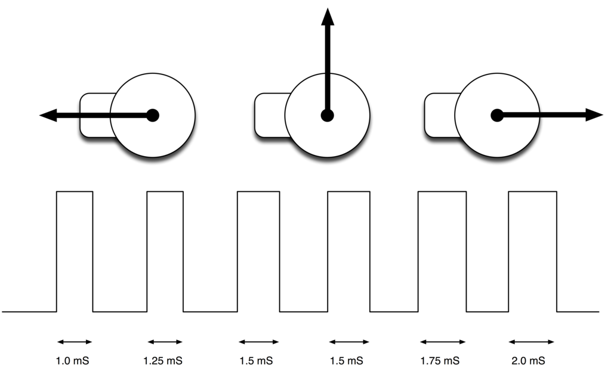

Adafruit has put together a [lovely illustrated walk-through](https://learn.adafruit.com/adafruit-arduino-lesson-14-servo-motors/) of the Arduino Servo Library examples. Let's walk through it together.

This is all to show that you don't have to re-invent the wheel AND that there are great resources for learning on your own, which is what you'll have to do for EVERY project you do until you are able to hire a wizard to do all that for you ;)

## Assignment 6:

1. Create a circuit that uses a transistor to control a relay that switches a high-current load (motor or LED strip)
2. Create a circuit that:
	* Uses the L293D to turn a motor based on an analog input
	* The motor should not move in a "middle" analog input range (around 512), spin one way if below 512 and spin the other if above.
	* The motor should close a physical switch
	* Count the number of times the switch is closed when spinning clockwise
	* Subtract from that count if spinning counter-clockwise
	* If the counter reaches 5, make an LED blink for 5 seconds, then reset the counter.

The more game-like you can make it, the better!

## Journal: Midterm Concept

Come up with a creative project idea for midterm---can be based on inspiration you found for Assignment 1

### Creative Prompt

* Find a problem or topic you want to explore... for example?
	* Sensing Humans
	* Evoking Emotions in Humans
	* Humans eliciting emotions in machines
	* World Hunger
	* Climate Change
	* etc...?
* Imagine a scenario, a narrative based on how your project engages with the topic of your choice
* Imagine an object that becomes central to that narrative


### Create a Journal Entry

* Describe your Project based on that Object (min 1 paragraph each)
	* Conceptual Description (what's the idea?)
	* Narrative Description (what will it look like? and how will it behave?)
	* Technical Description (what technologies/components/tools with you use?)
* You are required to use minimum of two inputs and two outputs.
* Publish research on the circuits you need to create
* Develop bock diagrams, schematics
* Define potential problems you might face.

## Research Presentation:

**Week 7** - Group 2: Is It Sustainable?
