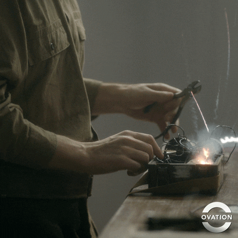
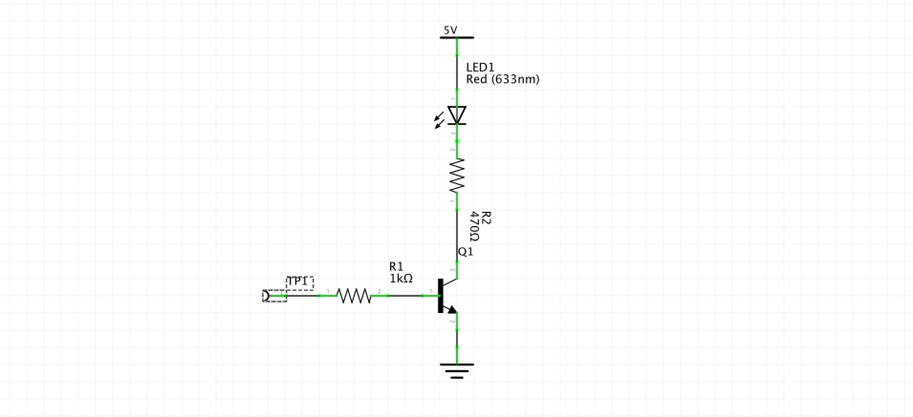
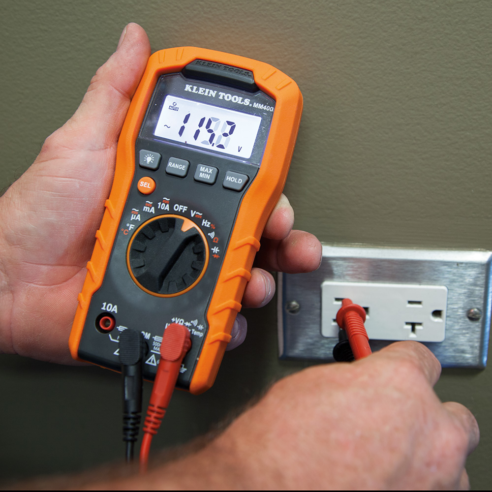
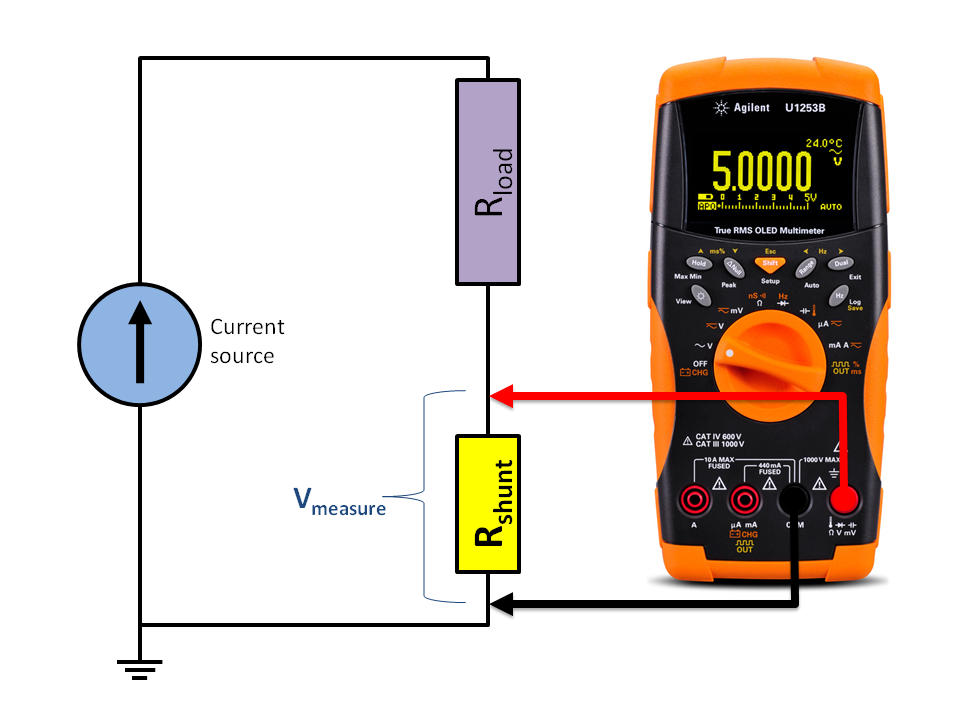
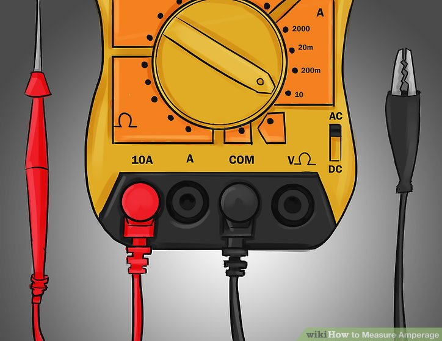
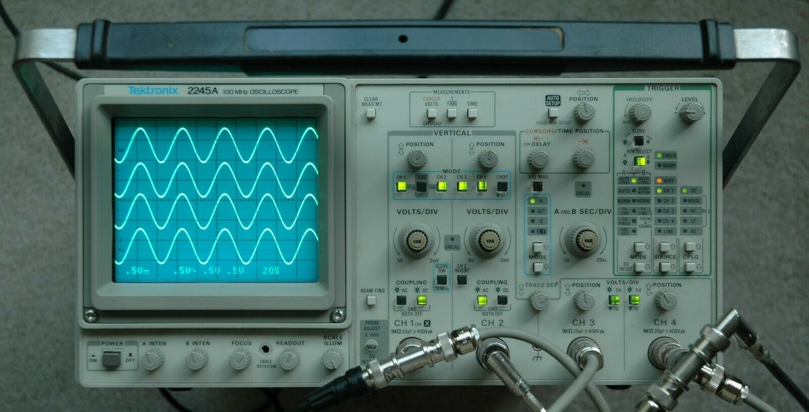
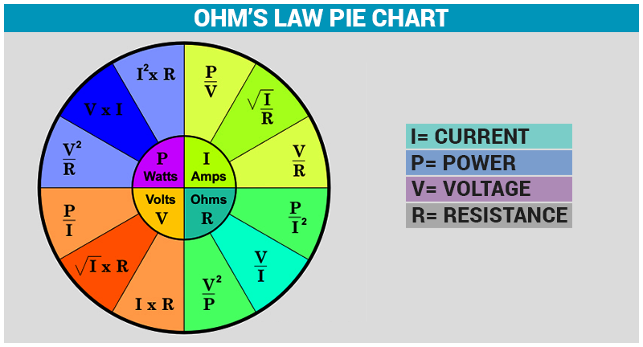
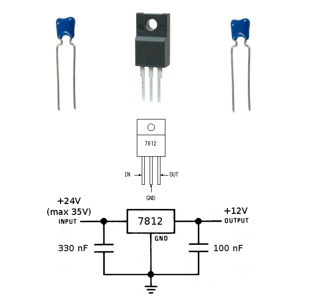
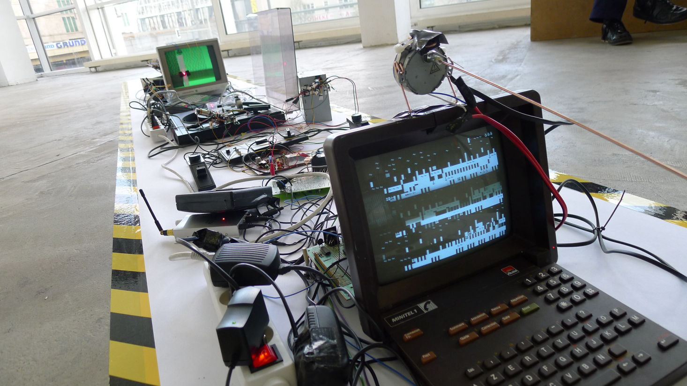

# WEEK 7


## Overview

* QA
* Research Presentation: Is It Sustainable
* Diagnostics
	* Circuit Debugging
	* Code Debugging
* Picking Power Supplies
* Inspiration

## QA


### ASSIGNMENT QUESTIONS???

* Everyone clear on motion control?

### MIDTERM QUESTIONS???

* Any conceptual questions you'd like to get feedback from the class on?
* Any technical questions you'd like to get feedback from the class on?

## Is It Sustainable?


## Diagnostics and Debugging


### How do we find and fix things when they break?

* Work modularly
	* Organize your breadboard (sections)
	* Organize your code (functions)
* Document your process
	* Comment your code
	* Sketch circuit diagrams
	* Draw out behavioral flow diagrams
* Practice sound debugging techniques
* Have and know how to use diagnostic equipment

## Debugging Circuits

	

* Indicators
* Multimeters
	* Volt Meter
	* Amp Meter
* Oscilloscopes

### Indicators

You can use LEDs to show digital outputs.

Here's an example of a transistor driven LED indicator:



* connect 5V to the +V power supply
* connect GND to the common ground of your circuit
* connect TP1 to wherever you want to check output

Sometimes you can get away with just using the LED and resistor, but this one will work more generally in most situations.

### Multimeters



* volts (AC/DC)
* amps (AC/DC)
* connectivity (diode polarity)
* frequency
* capacitance
* hFE

#### Volts

***Voltage is measured in parallel***

* connect to leads on the multimeter to +V and COM (GND) and set to measure voltage
* (choose AC or DC depending on your circuit!)
* to measure voltage **AT** a point:
	* connect GND or COM lead to common GND of the circuit
	* connect +V lead to the point in the circuit you want to measure
* to measure voltage **ACROSS** a component:
	* connect +V lead to the **positive** lead of the component
	* connect GND or COM lead to **negative** lead of the component

An example of measuring across a component:



#### Amps

***Current is measured in series***


* connect the +V test lead to the A socket on the multimeter
* set your multimeter to measure current (choose AC or DC depending on your circuit!)



* break the circuit where you want to measure current:
	* connect the +V test lead to the **positive** lead of the open circuit
	* connect the GND or COM to the **negative** lead of the open circuit

**NOTE: *BE CAREFUL!* Your multimeter actually completes your circuit. *NEVER* test the current from a power supply directly. You could break both the supply and your multimeter**

### Oscilloscopes



Oscilloscopes allow you you to see time varying signals. They're very useful for debugging timing issues.

Signals are displayed as traces. These are lines formed by moving a beam of electrons across a phosphorescent screen, much like how a TV works.

You can use an [oscilloscope as a video display](https://www.youtube.com/watch?v=T_n8PtMMLiQ).
You can also use a [TV as an oscilloscope](https://www.youtube.com/watch?v=QWh4wcPNwgM)**DANGER**

#### Layout and Controls

The main sections:

* **inputs:** each channel gets its own trace!
* **display:** X = time, Y = volts
	* **grid:** even divisions for measuring time/amplitude
	* **heads up display:** quick ref of scale settings
* **vertical controls:**
	* **position:** moves trace up or down
	* **scale:** volts per display divisions	
* **horizontal controls:**
	* **time position:** moves trace left and right
	* **time scale:** seconds per division (controls the sweep frequency)

* **trigger:** Allows you to sync the oscilloscope sweeps to your signal or to an external source.


## Debugging Code in Arduino


We need to make indicators, kinda like with the circuit debugging.

* Print to the console
	* [Functions that wrap `Serial.println()`](https://forum.arduino.cc/index.php?topic=215334.msg2438303#msg2438303)
	* Scaffolding
		* [Basic](https://forum.arduino.cc/index.php?topic=215334.msg1576067#msg1576067)
		* [Variadic Macros](https://forum.arduino.cc/index.php?topic=215334.msg1576381#msg1576381)

### A basic example of printing to the serial monitor:


```
// a basic example of using serial to check variables

void setup(){
	Serial.begin(9600);
}

void loop(){
	unsigned long x=millis();
	Serial.print("In loop(), variable x=");
	Serial.println(x);
	delay(1);
}

```

### An example of basic scaffolding:
		
```
// using definitions to implement scaffolding

#define DEBUG 1

void setup(){

	#ifdef DEBUG
	Serial.begin(9600);
	#endif
	
}

void loop(){

	int x=millis();
	
	#ifdef DEBUG
	Serial.print("In loop(), variable x=");
	Serial.println(x);
	#endif
	
	delay(1);
	
}

```

## Picking Power Supplies

1. Check what voltage your components require.
2. Check how much current your components will draw.
3. Add up all power requirements
4. Add 10-20% safety buffer

### USE OHM'S LAW



### Exercise


Let's say we want to make a piece that uses some neon LED strips.

Our project will need to power 36 feet of this specific [neon LED material](https://www.ledwholesalers.com/v2/index.php?route=product/product&path=39_81_96&product_id=1049)

* What voltage will we need?
* How much power will 36' consume?
* Find a suitable power supply on amazon.
* If we wanted to control 8 evenly divided sections, what kind of power requirements will we need our transistors to fulfill?

### Voltage Regulators



Allow you to step voltage down and maintain it as at a constant level.

Sometimes you have a 12V motor and a 5V digital control system. You only want to use on 12V supply, but the 12 volts will kill your 5V control electronics. This is where a voltage regulator will help. An 7805

Linear regulators aren't the most efficient but do the job well. Here are some common part numbers:

* [LM78XX](https://www.alldatasheet.com/view.jsp?Searchword=LM7805) - positive regulator where XX is the voltage
* [LM79XX](https://www.alldatasheet.com/view.jsp?Searchword=LM7905) - negative regulator where XX is the voltage
* [LM317](https://www.alldatasheet.com/view.jsp?Searchword=LM317) - adjustable regulator

## Inspiration

### [Recyclism](http://www.recyclism.com):[Refunct Media](http://www.recyclism.com/refunctmedia4.html)

[](https://www.youtube.com/watch?time_continue=87&v=g8tu47zRhpk/)

## Assignments:

### Research Group 3:

#### Chooose a topic from the ones left and present in two weeks

### WORK ON YOUR MIDTERMS

### JOURNAL: DOCUMENT YOUR MIDTERMS

* Document your research!
	* Images
	* Sketches
	* Experiments
	* Links of things that are helping
	* Work of those who came before you
* Document your thoughts!
	* Write them down.
	* Stuck? Ask friends and record their advice!
* Document your conceptual development.
* Document your aesthetic references.

#### Write it
#### Post it
