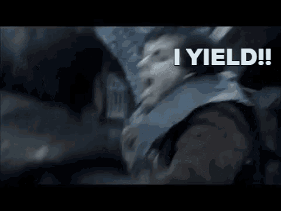
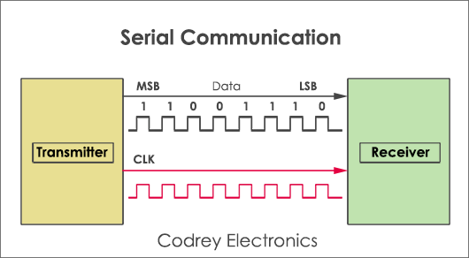
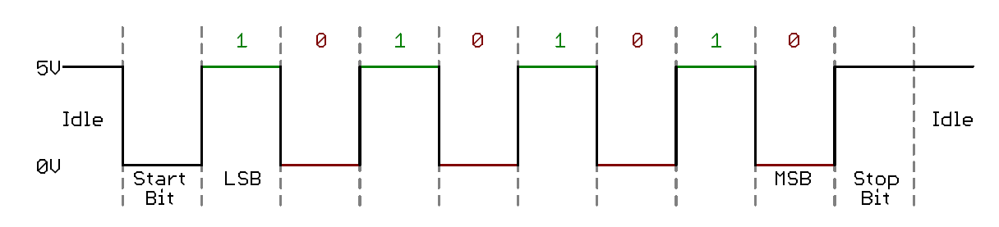
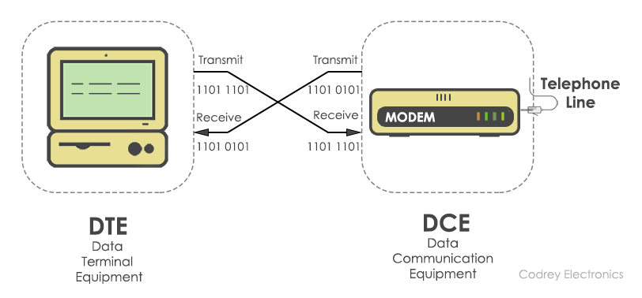
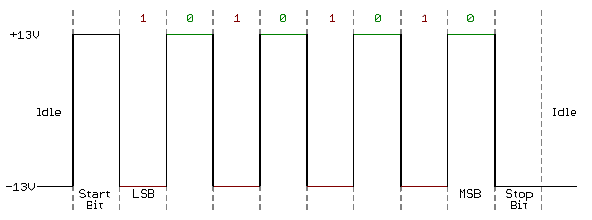
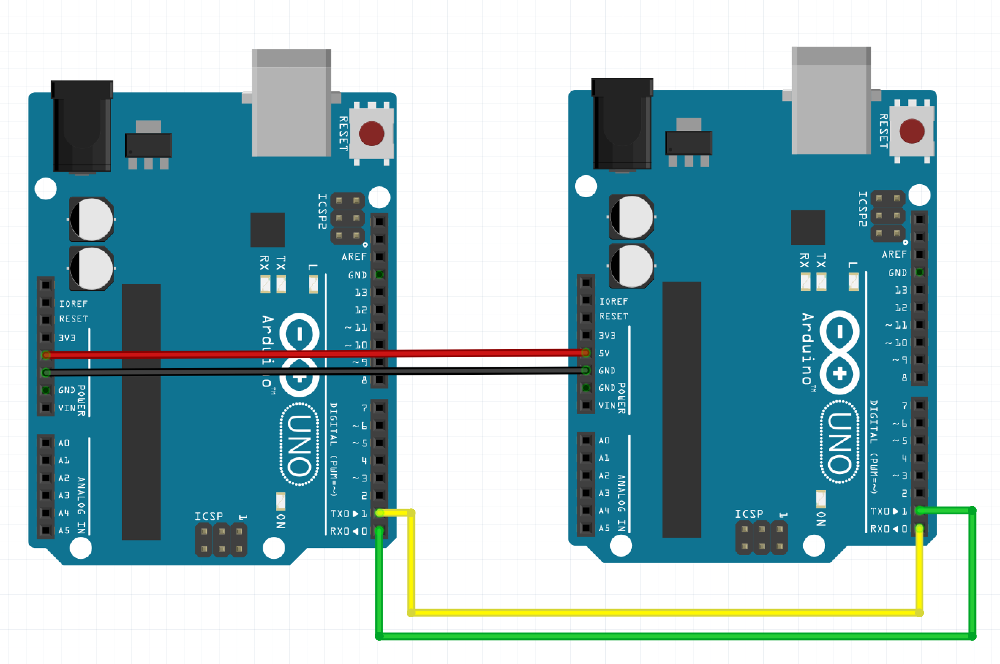

# WEEK 9

## Overview

* Group 3 Research Presentation
* Discussion
* Serial Communication

## Group 3 Research Presentation

## Discussion

* What are some of the key concepts?
* What perspectives do they illustrate?
* What perspectives are omitted?
* How can we integrate these concepts into our design practices?

## Serial Communication

Feeling lost? Head over to the [Arduino Reference on Serial](https://www.arduino.cc/reference/en/language/functions/communication/serial/)

Serial communication is a method of transmitting data between digital systems.

* Sending 1 bit at a time
* Sequential
* Designed for transmission over relatively long distances
* There are a few different methods and protocols: USB, Ethernet, WiFi, Bluetooth, etc.
  

## Concepts, Terms and Keywords:

* **M**ost **S**ignificant **B**it (**MSB**) - example: the `7` in `704`

* **L**east **S**ignificant **B**it (**LSB**) - example: the `1` in `53921`

* **Baud (Bd)** - The rate of data transmission. In binary systems, this is the *bit rate* or number of bits per second.

* **COM port** - A number associated with the particular physical connection on your computer that is used for serial **COM**munication.

## Protocols: UART

Most of our Arduino boards use UART for serial communications. This is 

### Universal Asynchronous Receiver-Transmitter

UART is the most common protocol used for full duplex (bi-directional) serial communication.

* It is a hardware peripheral that is present inside a microcontroller, like those in our Arduino boards.
* The function of UART is to convert the incoming and outgoing data into the serial binary stream.

### Format

A glimpse into how the UART formats data

1. **Start Bit** - communication starts with bit `0`
2. **Data** - 7 bits of data are transmitted (LSB first!)
3. **Parity Bit** - is used to error check
4. **Stop Bit** - ends the data transaction

## Protocols: TTL

* **TTL** stands for Transistor to Transistor Logic.
* TTL voltages remain between the 0V and Vcc (5V or 3.3V)
* Logic high ('1') is represented by Vcc
* Logic low ('0') is 0V.

### TTL logic levels

## Protocols: RS232

An older standard that is used in telecommunications. Dial-up modems used RS232.

[Learn ALL about it here!](https://www.codrey.com/embedded-systems/rs232-serial-communication/)

### RS232 Logic Levels

***NEEDS CONVERSION FROM ARDUINO***

If you're going to communicate between an Arduino and an RS232 device, be sure you use a level shifter. [more info](https://www.sparkfun.com/tutorials/215)

## Exercise: Monitor 2 Arduino

Have a look at these examples:

* [readString](arduino/readString/readString.ino)
* [pingPong](arduino/pingPong/pingPong.ino)
* [commandLine](arduino/commandLine/commandLine.ino)
* [stringComparison](arduino/stringComparison/stringComparison.ino)

Build a circuit that interactively displays the value of 2 different inputs using commands entered over serial.

Add to this functionality that controls two different outputs via commands entered over serial.

## Assignment 7: Arduino 2 Arduino

Create a communication system that allows Arduino 1 inputs to control Arduino 2 outputs and visa versa.

## Journal Week 9: Designing Interaction

 Team up with one or two friends to **design** a simple visualization/sonification project by using **sensor data** and **processing** (or another program you choose like PD, MAX, etc.).

* Write a Paragraph Description of the Project (narrative of what you are planning on doing/making)
* Write a Technical Description of tools, parts, techniques you'll use
* Create block diagrams, schematics, pseudocode to pre-visualize what you will make
* Publish your progress to Medium

If you have no experience with Processing, find someone who does and visa versa.

